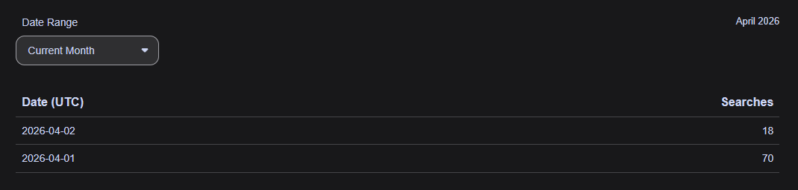

# April 2nd, 2026: How to break your domain

## Introductory context

Around November last year, I acquired a ThinkCentre M700 Tiny to run Proxmox on for homelab use. Right around that time, I was also in the middle of taking a class that used CompTIA's *Security Pro* training program.
*Security Pro* certainly has its biases; one of them being that when it covers IAM (Identity and Access Management), the only real-world example used is Microsoft's Active Directory. This may seem like I'm complaining, but I really didn't mind. I would've appreciated more examples, sure - but the fact is that AD is used in quite a lot of real-world enterprises.

With that in mind, the first two VMs I created on the Proxmox node are `ad-playground-server` and `ad-playground-client`. They run Windows (Server 2025/11 Enterprise respectively) with slightly horrible performance - no thanks to the virtualization layers on top of a 500GB hard drive (please make SSDs cheaper again). But it works way better for learning than CompTIA's extremely restrictive HTML labs!

Originally, everything contained in the homelab ran under a `til.pm` subdomain. That worked for approximately two seconds, until I tried to make publicly accessible applications, and ran into [Cloudflare restrictions](https://developers.cloudflare.com/ssl/troubleshooting/general-ssl-errors/#only-some-of-your-subdomains-return-ssl-errors:~:text=Cloudflare%20Universal%20SSL%20certificates%20only%20cover%20the%20apex%20domain%20%28example%2Ecom%29%20and%20one%20level%20of%20subdomains%20%28blog%2Eexample%2Ecom%29%2E) (whole other fun troubleshooting story entirely). There is no way around *not* giving them money if wanting to proxy with second-level subdomains like I envisioned.
Theoretically, yes I could upgrade my Cloudflare account with "Advanced Certificate Manager" and give them $10 monthly. The better solution was giving Porkbun $10 yearly for another domain, so that's what I did instead.

If you're wondering how the latter story connects to the former: The AD domain was set up before that Cloudflare oopsie, and therefore was still under `til.pm`. I really wanted things to be consistent, so the first order of business is renaming the AD domain, right?

## It was suspiciously easy

On the surface: Go into Active Directory Users and Computers, right click the domain, and "Change Domain." Microsoft was so generous to add a single button that does that. That's all, right?

Anyone who has more experience with this probably laughed really hard at that statement. The key being: it's DNS, it will always be DNS, and renaming your domain doesn't add any new records to the local DNS server (far as I'm aware, and I didn't want to find out). I did pull up [this guide from TheITBros.com](https://theitbros.com/how-to-rename-active-directory-domain/) beforehand, which gave me a great reference point to plan it out. It gave a rough process like so:

- Using `rendom /list`, generate a `Domainlist.xml` file.
- Open the `Domainlist.xml` file in Notepad, and use the find-and-replace tool to rename everything.
- Verify using `rendom /showforest`, then upload the changes to the DC using `rendom /upload`
- After all DCs (I only have this one) are done syncing, check using `rendom /prepare`, then `rendom /execute` to push changes.
  - The note said all DCs will get rebooted automatically after execution. I'm not sure if this is because of the single DC setup, but this didn't happen for me.

## What went wrong

**The DC itself still needs to be renamed to the new domain,** following that previous process. That's not actually the issue, but it's the start.

I asked: "Why not just actually rename this system from `WIN-XXXXXXXX` while I'm at it? `AD-PLAYGROUND-SERVER` looks so much more aesthetic." To put it bluntly: that was the mistake. After a DC reboot, I attempted to log back in, and got a great message:
> The security database on the server does not have a computer account for this workstation trust relationship.

In most cases, apparently this shows up when the system gets disassociated from AD forcefully. The solution is supposed to be running a PowerShell cmdlet `Test-ComputerSecureChannel`. How are you supposed to get a PowerShell prompt if you can't log in to the only account on the system?
> [!NOTE]
> While writing this, it began to make a lot of sense as to how that message showed up. Changing the name of the system means it will try to query the domain's DNS resolver for the new name, and run into an `NXDOMAIN` response. With that dependency not resolving, the system's next best assumption is that the domain controller is *completely* missing. It's not prepared for that and ends up freaking out with that message.

I was then lead to Directory Services Repair Mode, which you can get to by mashing F8 on boot. This is (as far as I've known) the only way to access the local admin account on a DC - but with a catch. It's basically a special version of Safe Mode with Networking that disables the Directory Services, DNS, etc. Whatever the actual difference is, it does just enough so that the VirtIO network adapter isn't detected.

Alas, at this point I was furiously exchanging ideas with AI to try and navigate this (since I pay Kagi for search and there's AI chat there). In hindsight, it was probably a waste of tokens and my Starter plan search quota to do so. Some things it told me to do in DSRM:

- Rebuild the data in the netlogon service (`Netlogon.dns`/`Netlogon.dnb`)
- Rename the server back (for some reason, this was something I didn't feel like doing)
  - At some point, I actually did try it. I think the rename process is hardwired too much into the services that were not online, as both the Settings app and `netdom renamecomputer` (don't know if they are the same mechanism) failed in DSRM.
- Use the ADSI Edit snap-in to manually edit the domain admin account
- Checking database integrity using `ntdsutil`

It also proposed the `Test-ComputerSecureChannel` cmdlet "once I can boot normally and login."

I guess the planning isn't bad, but there's a difference between planning and execution. Maybe I need to brush up my prompting (and above all, my wording) skills...

## The fix itself

I woke up on the 2nd, and thought to myself about the events from yesterday's debugging session.

My thought process: if DSRM is very similar to Safe Mode with Networking, why not just try Safe Mode with Networking?

To my surprise, when I tried that, I was able to log into the domain admin account normally. I renamed the server back to `WIN-(whatever it is)` and one reboot later, it actually allowed me to log in. All services came online, and the forest was intact.

## Lessons learned and conclusion

- Don't do both of those actions at the same time. The DNS setup is too fragile to handle both changes at the same time with AD having such a heavy dependency on the resolver.
  - The local login service was likely trying to reach `AD-PLAYGROUND-S.ad-testnet.domain`, which didn't exist. I have no logs to prove it, but this would be a reasonable hypothesis in my opinion.
  - With it "always being DNS," the next question is can these records be migrated with reasonable effort - if so, how?
    - When discussing with AI, it was pretty hammered in that on-the-fly renaming like this is a bad idea. The suggested best way to go around it was demoting the DC to a member server, renaming, then promoting again. I assume this automatically recreates the necessary records with the proper hostname.
    - However, on a single-DC setup like I have, this would completely destroy the forest. In an ideal setup you have two or more DCs running, but I don't. Is the only option backing up everything to disband the forest, then creating a new one and restoring said backup?
- I didn't do ANY backups before changing settings - a bad habit. I am rather unfamiliar with the built-in mechanisms to do so in Windows Server, but this will be something I have to learn.
  - Yes, you can call me a horrible sysadmin for that, it's okay.
  - To be honest, backups are a foreign thing to me both as a regular PC user and a majority Linux sysadmin. This is in part because I wasn't able to afford the reserve storage for backup purposes even when it was cheap - and the 1TB external drive I had for this express purpose didn't really have the room either with other stuff on it :(.
    - Even two budget SSD failures on my personal rig couldn't teach me a lesson, for that reason.
- Once again, it's a nice reminder to focus on one thing at a time. If I kept the `WIN-` hostname, then there wouldn't have been any issues. Even after running the rename command, if I created a backup, being able to restore the previous state would've saved me precious hours debugging the issue.

I feel quite lucky to have experienced this in a controlled environment with almost no data, rather than a production system with people counting on it to work. In the many years I've read professional sysadmin stories online, accidentally taking a company network offline seems to be a "rite of passage" for juniors. That's one of the rare lessons better learned when you're unemployed, rather than employed.
